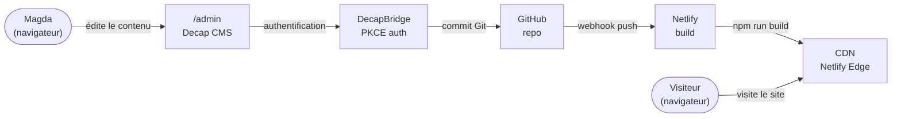

# Tout au Chaud

Site vitrine statique avec interface d'administration en français, pour une artisane textile qui gère elle-même son contenu.

## Description

Projet réalisé pour Magda, créatrice de vêtements faits main en Suisse romande, sans aucune compétence technique. L'objectif : lui donner une présence en ligne qu'elle peut faire vivre seule — ajouter une pièce, changer une photo, corriger un texte — sans repasser par un développeur à chaque modification, et sans coût d'hébergement récurrent.

La réponse technique est une architecture Jamstack : Eleventy compile des templates Nunjucks et des données YAML/Markdown en HTML statique, Decap CMS fournit une interface d'édition entièrement traduite en français, et chaque enregistrement dans l'admin déclenche un commit Git puis un redéploiement automatique sur Netlify. Aucune base de données, aucun framework front-end, aucune dépendance JavaScript côté visiteur : le CSS et le JS sont écrits à la main (menu responsive, carousel de pièces, validation et envoi AJAX du formulaire de contact).

L'intérêt du projet est moins dans la complexité technique que dans le compromis : faire tenir un CMS utilisable par une non-technicienne dans un site qui reste un dossier de fichiers HTML servis par un CDN.

## Site en ligne

**[toutauchaudme.ch](https://toutauchaudme.ch)** — interface d'administration sur [/admin](https://toutauchaudme.ch/admin) (accès restreint).

## Stack technique

| Technologie | Rôle |
|---|---|
| **Eleventy v3** (`@11ty/eleventy`) | Générateur de site statique |
| **Nunjucks** | Moteur de templates (`.njk`) |
| **Markdown** (`markdown-it`) | Contenu des pièces + rendu de la biographie via un filtre custom |
| **YAML** (`js-yaml`) | Données éditables (`src/_data/`), chargées via `addDataExtension` |
| **Decap CMS v3** | Interface d'édition headless, servie depuis `/admin` |
| **DecapBridge** | Authentification PKCE du CMS (remplace Netlify Identity) |
| **Formspree** | Traitement du formulaire de contact (envoi AJAX + honeypot anti-spam) |
| **Netlify** | Hébergement, build à chaque push, CDN |
| **CSS / JavaScript vanilla** | Styles et interactions, sans build ni dépendance |

## Fonctionnalités principales

- **Édition autonome du contenu** : textes, photos et coordonnées sont stockés en YAML/Markdown et modifiables depuis l'interface admin, sans toucher au code.
- **Collection de pièces** : un fichier Markdown par création, trié par un champ `ordre`, générant automatiquement une page dédiée (`/pieces/<slug>/`) via un permalink dynamique.
- **Carousel d'accueil** en JS vanilla (navigation par flèches, recalcul du décalage au redimensionnement avec debounce).
- **Formulaire de contact** branché sur Formspree : validation côté client, envoi en JSON sans rechargement, champ honeypot `_gotcha` contre les bots.
- **Navigation responsive** avec menu hamburger accessible (`aria-expanded`, fermeture au clic extérieur et au passage en desktop).
- **Publication automatique** : chaque enregistrement dans le CMS produit un commit Git signé du nom de l'éditrice, qui déclenche le build et le déploiement.
- **SVG inlinés** via un shortcode Eleventy custom, pour que le logo hérite de `currentColor`.

## Aperçu visuel

<!-- capture d'écran à ajouter -->

## Installation locale

```bash
git clone https://github.com/Artjaq/Projet_Magda.git
cd Projet_Magda
npm install
npm run dev      # serveur de développement sur http://localhost:8080
```

Build de production :

```bash
npm run build    # génère le site statique dans _site/
```

Aucune variable d'environnement n'est nécessaire pour le développement local. L'interface `/admin` requiert en revanche l'authentification DecapBridge et ne fonctionne que sur le site déployé.

Le déploiement Netlify est configuré par [netlify.toml](netlify.toml) (commande `npm run build`, dossier publié `_site`, Node 20).

## Structure du projet

```
src/
├── _data/              → Contenu éditable (YAML, exposé globalement par Eleventy)
│   ├── site.yaml           Nom, slogan, email, Instagram
│   ├── accueil.yaml        Hero, grille de pièces, section présentation
│   ├── apropos.yaml        Biographie, photo, processus
│   └── contact.yaml        Textes et coordonnées
├── _includes/          → Templates partagés (Nunjucks)
│   ├── base.njk            Layout : <head>, header, footer, scripts
│   ├── header.njk          Navigation + menu hamburger
│   ├── footer.njk          Pied de page
│   └── piece.njk           Layout d'une page pièce
├── pieces/             → Une pièce = un fichier .md (+ pieces.json pour layout/permalink)
├── uploads/            → Images envoyées depuis le CMS
├── admin/              → Decap CMS (index.html + config.yml des champs éditables)
├── logo/               → SVG inlinés par le shortcode 
├── index.njk           → Accueil
├── apropos.njk         → À propos
├── contact.njk         → Contact (formulaire Formspree)
├── styles.css          → CSS vanilla, copié tel quel
└── scripts.js          → JS vanilla (menu mobile, carousel)
```

Configuration Eleventy (filtres `markdownify` / `zerofill`, shortcode `svg`, collection `pieces`, passthrough copies) : [.eleventy.js](.eleventy.js).

Les fichiers HTML/CSS/JS à la racine du dépôt correspondent au prototype statique antérieur à la migration Eleventy, conservé hors du build (`input: src`). [à compléter : les supprimer ou les archiver]

## Décisions techniques

### Site statique plutôt que WordPress

Le réflexe habituel pour un client non-technique est WordPress. Mais un site de trois pages sans stock, sans panier et sans commentaires n'a pas besoin d'une base de données, d'un serveur PHP ni de mises à jour de sécurité mensuelles : il a besoin qu'une non-technicienne puisse changer un texte ou envoyer une photo. L'architecture statique répond à ce besoin avec un hébergement à coût nul, une surface d'attaque quasi inexistante et des performances CDN par défaut.

Compromis accepté : pas de recherche ni de filtrage dynamique sur les pièces — hors cahier des charges.

### Eleventy plutôt que Hugo, Astro ou Next.js

Hugo compile plus vite, mais son langage de templates devient pénible à déboguer dès qu'on sort des cas standards, et le projet demandait des filtres personnalisés (rendu Markdown avec classe CSS injectée, formatage de numéros). Next.js est surdimensionné pour un site sans interactivité côté serveur. Astro était une option sérieuse, mais son modèle par composants aurait imposé de réécrire une feuille de styles vanilla déjà aboutie autour de styles scopés.

Point de friction rencontré : en Eleventy v3, les fichiers `.yaml` ne sont plus chargés par défaut comme en v2 — résolu par `addDataExtension("yaml,yml", ...)`.

### DecapBridge plutôt que Netlify Identity

Le projet a démarré sur Netlify Identity + Git Gateway, la combinaison historiquement recommandée pour Decap CMS. Deux raisons ont motivé la migration : Netlify Identity est une fonctionnalité secondaire pour Netlify, progressivement dépriorisée ; et son architecture charge `netlify-identity-widget.js` sur chaque page publique, y compris pour des visiteurs qui n'ont aucune raison de s'authentifier.

DecapBridge est dédié à l'écosystème Decap et utilise un flux PKCE : aucun JavaScript d'authentification sur le site public, aucun secret dans le dépôt (le seul identifiant présent dans `config.yml` est l'ID de site, semi-public par conception dans PKCE, où la sécurité repose sur un code verifier éphémère). Le compromis est une dépendance de plus envers un service tiers — acceptable ici, à réévaluer sur un projet plus critique.

## Architecture



## Documentation

- [docs/DEPLOY.md](docs/DEPLOY.md) — déploiement Netlify, configuration DecapBridge, ajout de champs et de collections
- [docs/EDITION.md](docs/EDITION.md) — guide d'utilisation pour l'éditrice, sans jargon technique

## Licence

[MIT](LICENSE) — Arthur Jaquier, 2025

## Auteur

**Arthur Jaquier** — [GitHub](https://github.com/Artjaq) 
